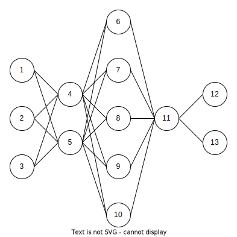

# Generate K partite complete graph

- [Description](#description)
- [Usage](#usage)

## Description

This npm repository exports a function `generateKPartiteCompleteGraph(partitionsDescription: number[]): Map<string, string>`.

The function, given an array of numbers `A` of length `K` returns a `K` complete partite graph in which every partition 
`P[i]` has `A[i]` amount of nodes.

The returned graph is a JavaScript Map where keys are base 10 stringified numbers representing nodes names and values
are arrays of base 10 stringified numbers representing the neighbours of the node corresponding to that key.

The function grants to return a proper value given a proper parameter, the parameter must be an array of positive 
integer numbers. The function does not perform any check on the given parameter.

The algorithm has a time complexity of O(2V) and a space complexity of O(2V) where V is the number of nodes in the
graph.

## Usage
```javascript
const {generateKPartiteCompleteGraph} = require("./generateKPartiteCompleteGraph");

const graph = generateKPartiteCompleteGraph([3, 2, 5, 1, 2]);
```

The graph variable, will have the following value:

```
Map(13) {
  '1' => [ '4', '5' ],
  '2' => [ '4', '5' ],
  '3' => [ '4', '5' ],
  '4' => [
    '1', '2',  '3',
    '6', '7',  '8',
    '9', '10'
  ],
  '5' => [
    '1', '2',  '3',
    '6', '7',  '8',
    '9', '10'
  ],
  '6' => [ '4', '5', '11' ],
  '7' => [ '4', '5', '11' ],
  '8' => [ '4', '5', '11' ],
  '9' => [ '4', '5', '11' ],
  '10' => [ '4', '5', '11' ],
  '11' => [
    '6',  '7',  '8',
    '9',  '10', '12',
    '13'
  ],
  '12' => [ '11' ],
  '13' => [ '11' ]
}
```

An image representation of the created graph is the following: 


